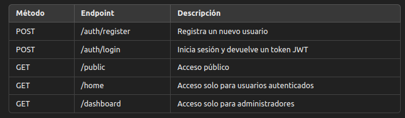

# Proyecto Spring Security con JWT

Este proyecto implementa un sistema de autenticación y autorización utilizando Spring Security y JWT (JSON Web Token). Permite el registro de usuarios, inicio de sesión, y el acceso a recursos protegidos basados en roles (usuario y administrador).

## spring security con jwt


## Características

- Registro de usuarios con validación de correos electrónicos únicos.
- Autenticación de usuarios mediante credenciales (correo y contraseña).
- Generación de tokens JWT para el acceso a recursos protegidos.
- Protección de rutas según roles (usuario y administrador).
- Uso de BCrypt para el cifrado de contraseñas.

## Tecnologías Utilizadas

- Java 17
- Spring Boot
- Spring Security
- Spring Data Jpa
- JWT (JSON Web Token)
- Lombok
- Database MySQL
- Maven
- Dotenv

## Estructura del Proyecto

```bash
com.arielZarate.springSecurityJwt
├── .env
├── config
│   ├── JwtTokenUtil.java
│   ├── PasswordConfig.java
│   └── WebSecurity.java
├── controllers
│   └── AuthController.java
├── entity
│   ├── AuthDetailModel.java
│   ├── Role.java
│   └── User.java
├── repository
│   └── UserRepository.java
├── services
│   ├── AuthService.java
│   └── UserDetailServiceImpl.java
└── utils
    └── ValidateAuth.java

```

## Instalación

1. **Clonar el repositorio:**

   ```bash
   git clone `https://github.com/arielZarate/spring-security-loginWithJwt.git`
   cd springSecurityJwt

   ```

2. Configurar la base de datos: Modifica la configuración de tu base de datos en src/main/resources/application.properties o application.yml.

3. construir el proyecto
   `mvn clean install`
4. Ejecutar el proyecto
   `mvn spring-boot:run`

## Registro de Usuario

Para registrar un nuevo usuario, realiza una solicitud POST a /auth/register con el siguiente cuerpo en formato JSON:

```json
{
  "email": "usuario@ejemplo.com",
  "password": "tu_contraseña",
  "role": "ROLE_USER" // o ROLE_ADMIN
}
```

## Inicio de Sesión

Para iniciar sesión, realiza una solicitud POST a /auth/login con el siguiente cuerpo en formato JSON:

```json
{
  "email": "usuario@ejemplo.com",
  "password": "tu_contraseña"
}
```

## Acceso a Recursos Protegidos

- Ruta pública: /public - Acceso sin autenticación.
- Ruta para usuarios: /home - Requiere autenticación para usuarios y administradores.
- Ruta para administradores: /dashboard - Requiere autenticación solo para  
   administradores.

## Ejemplo de uso de JWT

Después de iniciar sesión, recibirás un token JWT que debes incluir en el encabezado Authorization de tus solicitudes a recursos protegidos:  
`Authorization: Bearer <tu_token_jwt>`

## API

## Endpoints



## Vartiables de entorno

Dependencias

```xml
		<dependency>
			<groupId>io.github.cdimascio</groupId>
			<artifactId>dotenv-java</artifactId>
			<version>3.0.2</version>
		</dependency>
```

Se configuro el archivo properties

```java
# VARIABLES DE ENTORNOS
spring.jwt.expiration-time=${EXPIRATION_TIME}
spring.jwt.secret-key=${SECRET_KEY}

```

### .env

```java

SECRET_KEY=bmVhcmVycmFpbmZvcndhcmRmYWNpbmdzdW5saWdodHNob3dhbnl0aGluZ2RvemVuZGk=

EXPIRATION_TIME=32400000  # 9 horas en milisegundos
```

En mi clase JwtTokenUtil

```java


@Component
public class JwtTokenUtil implements Serializable {

    @Value("${spring.jwt.secret-key}")
    private  String SECRET_KEY;    //= "bmVhcmVycmFpbmZvcndhcmRmYWNpbmdzdW5saWdodHNob3dhbnl0aGluZ2RvemVuZGk="; // Cambia esto por una clave más segura

    @Value("${spring.jwt.expiration-time}")
    private  long EXPIRATION_TIME ;  //= 1000 * 60 * 60 * 9; // 9 hora en milisegundos


    //sigue el codigo
}
```

- NOTA: DEJE EXPUESTO LAS VARIBALES DE ENTORNO PORQUE SOLO ES UN EJEMPLO PERO OBVIAMENTE ESTO NO DEBE SUBIRSE
  NO DEBE QUEDAR NADA EXPUESTO EN EL REPOSITORIO . (LO EXPLICO POR SI ACASO ALGUIEN CREE QE NO LO SE )

## Configuración

### Configuración de Seguridad

El sistema utiliza Spring Security para manejar la autenticación y autorización. El filtro de JWT es añadido a la cadena de filtros de seguridad de Spring.

### Cifrado de Contraseñas

Las contraseñas se cifran utilizando BCrypt para mejorar la seguridad.

## Contribuciones

Las contribuciones son bienvenidas. Por favor, abre un issue o un pull request si deseas aportar.

## Licencia

```bash

### Notas

Con este `README.md`, tu proyecto será más accesible y fácil de entender para otros desarrolladores. ¡Espero que te sirva!

```
